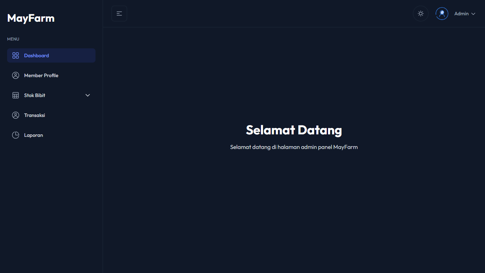

# 📘 admin-lele Manual Book

Dokumen ini merupakan panduan lengkap (*manual book*) untuk menjalankan web admin-lele yang telah di-upload ke GitHub.  




## 📥 Download Project

Ikuti langkah berikut untuk mengunduh project:

1. Buka repository GitHub ini:  
   https://github.com/ahmadfadhilah99/admin-lele.git
2. Klik tombol **Code** (warna hijau).
3. Pilih **Download ZIP**.
4. Ekstrak file ZIP ke folder manapun di komputer Anda.


## ⚙️ Persyaratan Sistem

Pastikan perangkat Anda sudah memiliki:

- Node.js versi **16+**  
  Download di: https://nodejs.org/
- NPM (terinstall otomatis bersama Node.js)
- Code editor (disarankan: **Visual Studio Code**)

Untuk mengecek versi Node.js dan npm:

```bash
node -v
npm -v
```

## 📦 Instalasi Dependency

Setelah file ZIP diekstrak, lakukan langkah berikut:

- Buka folder project menggunakan VS Code atau terminal.
- Jalankan perintah berikut untuk menginstal seluruh dependency:

```bash
npm install
```
Perintah ini akan menginstal seluruh library yang dibutuhkan berdasarkan file package.json.


## ▶️ Menjalankan Project (Development)

Untuk menjalankan aplikasi dalam mode development, gunakan:

```bash
npm run dev
```

Aplikasi biasanya dapat diakses melalui:
```bash
http://localhost:5173/
```


Catatan: Port dapat berbeda jika port default telah terpakai.
